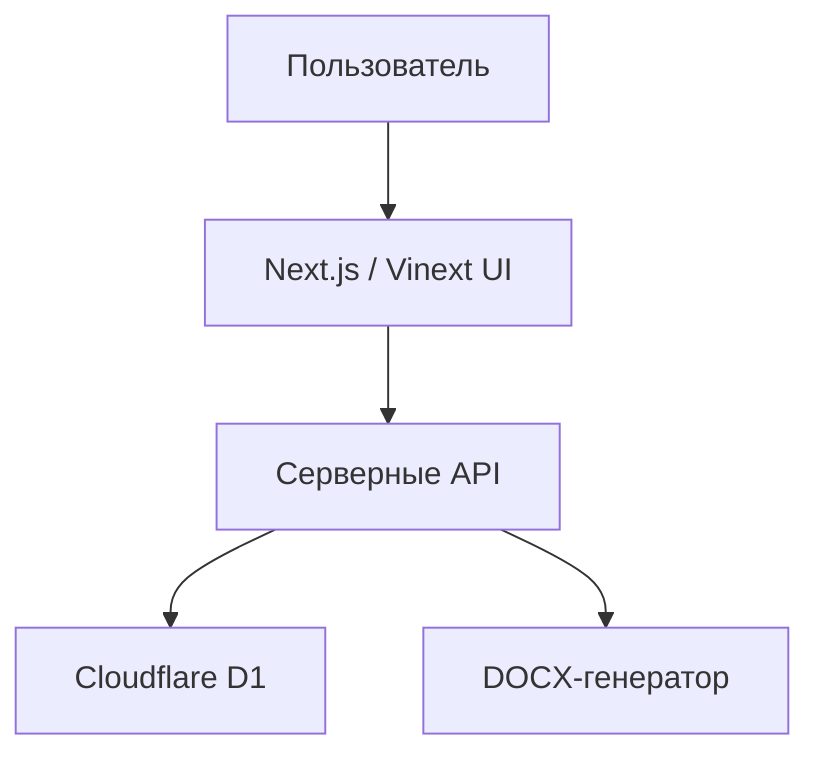

# Развёртывание без ChatGPT Sites

Проект подготовлен к работе как обычное серверное приложение на Cloudflare Worker + D1. Привязка к Sign in with ChatGPT удалена из основного auth-слоя.

## Что уже сделано

- Авторизация заменена на email + пароль.
- Пароли хранятся только как bcrypt-хэши в таблице `auth_users`.
- Сессии хранятся на сервере в D1, таблица `auth_sessions`.
- Добавлены регистрация, вход, выход и восстановление пароля без почтовой отправки.
- Пользователь при регистрации выбирает желаемую роль.
- Фактическая роль остаётся в `user_profiles.role` и назначается администратором.
- Добавлен bootstrap первого администратора через `INITIAL_ADMIN_EMAIL`.
- Cloudflare D1 оставлен основной БД.
- Миграции применяются одной командой через Wrangler.

## Текущая схема



## Таблицы авторизации

| Таблица | Назначение |
| --- | --- |
| `auth_users` | email, bcrypt-хэш пароля, отображаемое имя |
| `auth_sessions` | серверные сессии, хэш session-token, срок действия |
| `password_reset_tokens` | одноразовые токены восстановления пароля |
| `user_profiles` | желаемая роль, фактическая роль, активная роль администратора |

## Роли

Роль не становится фактической автоматически, кроме первого администратора.

| Действие | Результат |
| --- | --- |
| Пользователь регистрируется и выбирает роль | выбранная роль сохраняется как `requested_role` |
| Обычная регистрация | фактическая роль `author` |
| Email совпал с `INITIAL_ADMIN_EMAIL` | фактическая роль `admin` |
| Администратор меняет роль | обновляется `user_profiles.role` |
| Администратор переключает режим | обновляется `user_profiles.acting_role` |

## Переменные окружения

Задаются как Cloudflare secrets:

- `INITIAL_ADMIN_EMAIL` — первый администратор;
- `PROGRAM_ADMIN_EMAILS` — необязательный список администраторов через запятую;
- `CLOUDFLARE_API_TOKEN` — только для CI/CD;
- `CLOUDFLARE_ACCOUNT_ID` — только для CI/CD.

Для подготовки `dist/server/wrangler.json` перед удалённой миграцией и деплоем задаются в окружении запуска команды:

- `CLOUDFLARE_D1_DATABASE_ID`;
- `CLOUDFLARE_D1_DATABASE_NAME`.

Не хранить в GitHub:

- реальные email администраторов, если они считаются чувствительными;
- токены Cloudflare;
- дампы D1;
- выгруженные программы с персональными данными.

## Миграции

После сборки:

```bash
pnpm run db:migrate:remote
```

Команда применяет все SQL-файлы из `drizzle/` к удалённой D1-базе, указанной в Wrangler-конфигурации.

## Восстановление пароля

Почтовый сервис пока не подключён. Страница `/forgot-password` создаёт одноразовую ссылку и показывает её на экране. Для production-сценария следующий шаг — подключить почтовый провайдер и отправлять эту ссылку пользователю.

Подходящие варианты:

- Resend;
- SendGrid;
- корпоративный SMTP/API-шлюз.

## Что осталось для промышленной эксплуатации

- Указать реальный `database_id` D1 через `CLOUDFLARE_D1_DATABASE_ID`.
- Настроить секреты Cloudflare.
- Подключить отправку писем для восстановления пароля.
- Добавить журнал действий администратора и проверяющих.
- Настроить резервное копирование D1.
- Проверить DOCX-выгрузку на утверждённых макетах после production-деплоя.

## Контроль готовности

Перед промышленным запуском проверить:

- регистрация и вход по email + пароль;
- создание первого администратора;
- назначение ролей обычным пользователям;
- переключение роли администратора;
- создание ДООП, ПК и ПП;
- сохранение РПД/РПР;
- комментарии проверяющего ко всем полям и строкам;
- блокировку отправки при критических ошибках;
- невозможность выгрузки автором до согласования;
- DOCX-порядок разделов, нумерацию, титульный лист, таблицы и литературу.
